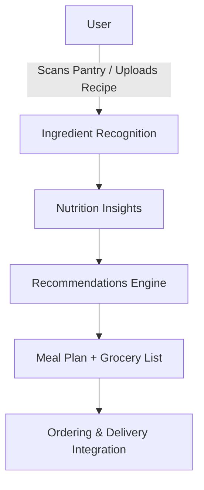

# Nutriflow

## Team Members

- **Randy Hucker**

  - Major: Computer Science
  - Email: [randalhucker@gmail.com](mailto:randalhucker@gmail.com)
  - [LinkedIn](https://www.linkedin.com/in/randy-hucker)

- **Sam Graler**
  - Major: Computer Science
  - Email: [gralersm@mail.uc.edu](mailto:gralersm@mail.uc.edu)
  - [LinkedIn](https://www.linkedin.com/in/sam-graler)

---

## Project Topic Area

**Intelligent Food Ecosystem** - An AI/ML-driven platform that delivers nutrition insights, personalized food recommendations, smart grocery planning, and sustainability tracking.

---

## Project Faculty/Industry Advisor

- **Dr. William Hawkins**  
  Assistant Professor of Computer Science  
  University of Cincinnati  
  📧 [hawkinwh@ucmail.uc.edu](mailto:hawkinwh@ucmail.uc.edu)

---

## Abstract (a. Problem Statement)

Modern consumers struggle to balance nutrition, affordability, and sustainability in their food choices. Information is scattered across recipes, grocery stores, and nutrition trackers. **Nutriflow** addresses this by providing a unified platform for healthier, smarter, and more cost-effective eating.

---

## Inadequacy of Current Solutions (b)

- **Nutrition Trackers** (e.g., MyFitnessPal) focus on logging, not proactive food guidance.
- **Meal Kits** provide convenience but are costly and don't reduce food waste.
- **Grocery Delivery Apps** solve logistics but ignore nutrition, substitutions, and sustainability.

There is **no integrated solution** connecting personal preferences, pantry inventory, pricing data, and AI recommendations.

---

## Technical Background (c)

Nutriflow combines **data engineering, AI/ML, and user-centric design**:

- **Data Pipelines** - Web scraping + APIs for grocery pricing, availability, and nutrition data.
- **AI/ML Models** - Ingredient recognition, recipe generation, substitution suggestions.
- **Interactive UX** - Dashboards, recipe views, and meal planners.
- **Cloud Infrastructure** - GitHub repo, containerization, scalable backend services _(AWS **Lambda** & **Aurora**)_.

---

## Team Approach (d)

- **Agile Iterations** to incrementally deliver scraping, recognition, and recommendation features.
- **Faculty Guidance** from Dr. Hawkins for technical depth and academic rigor.
- **Future Expansion**: Household collaboration, sustainability tracking, gamification, and premium features.

---

📌 This document will evolve over the term to include project updates, architecture details, and progress milestones.
