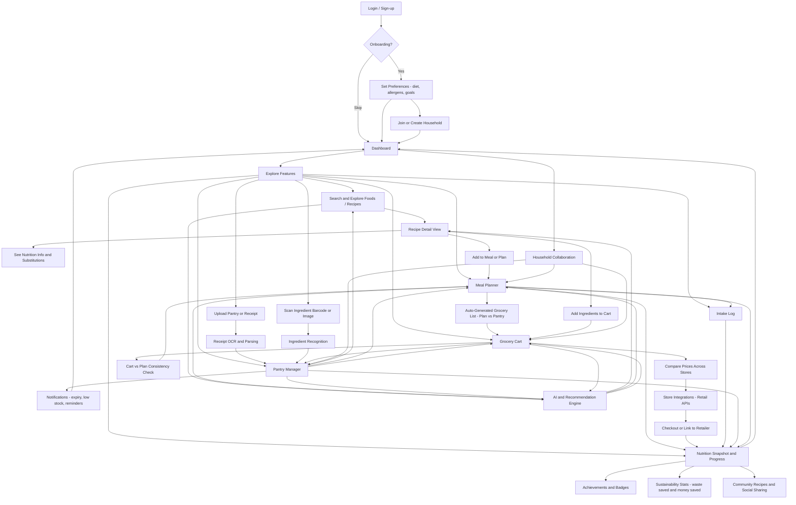

# NutriFlow Project Description

### Team Members

- **Randy Hucker**
  - Major: Computer Science
  - Email: [randalhucker@gmail.com](mailto:randalhucker@gmail.com)
  - [LinkedIn](https://www.linkedin.com/in/randy-hucker)

- **Sam Graler**
  - Major: Computer Science
  - Email: [gralersm@mail.uc.edu](mailto:gralersm@mail.uc.edu)
  - [LinkedIn](https://www.linkedin.com/in/sam-graler)

### Project Faculty/Industry Advisor

- **Dr. William Hawkins**  
  - Assistant Professor of Computer Science, University of Cincinnati  
  - Email: [hawkinwh@ucmail.uc.edu](mailto:hawkinwh@ucmail.uc.edu)
  - [LinkedIn](https://www.linkedin.com/in/whh3/)

---

### Project Topic Area

**Intelligent Food Ecosystem** - An AI/ML-driven platform that delivers nutrition insights, personalized food recommendations, smart grocery planning, and sustainability tracking.

---

### Project Abstract

**Problem Statement**: Modern consumers struggle to balance nutrition, affordability, and sustainability in their food choices. Information is scattered across recipes, grocery stores, and nutrition trackers leading to inconsistency and frustration.

**Abstract**: NutriFlow addresses the difficulty of planning healthy, affordable meals by unifying recipes, nutrition data, pantry inventory, pricing, and household coordination. Smart cart generation, pantry management, and our AI-assisted recommendation engine support a unique meal planning experience that reaches across the entire process, from gathering recipes to try to bringing groceries in from your doorstep.

---

### Inadequacy of Current Solutions

- **Nutrition Trackers** (e.g., MyFitnessPal) focus on logging, not proactive food guidance.
- **Meal Kits** provide convenience but are costly and don't reduce food waste.
- **Grocery Delivery Apps** solve logistics but ignore nutrition, substitutions, and sustainability.

There is **no integrated solution** connecting personal preferences, pantry inventory, pricing data, and AI recommendations.

---

### Technical Background

NutriFlow combines **data engineering, AI/ML, and user-centric design**:

- **Interactive UX** - Dashboards, recipe views, and meal planners.
- **Data Pipelines** - Web scraping + APIs for grocery pricing, availability, and nutrition data.
- **AI/ML Models** - Ingredient recognition, recipe generation, substitution suggestions.
- **Cloud Infrastructure** - GitHub repo, containerization, scalable backend services _(AWS **Lambda** & **Aurora**)_.

---

### Team Approach

- **Agile Iterations** to incrementally deliver scraping, recognition, and recommendation features.
- **Faculty Guidance** from Dr. Hawkins for technical depth and academic rigor.
- **Future Expansion**: Household collaboration, sustainability tracking, gamification, and premium features.