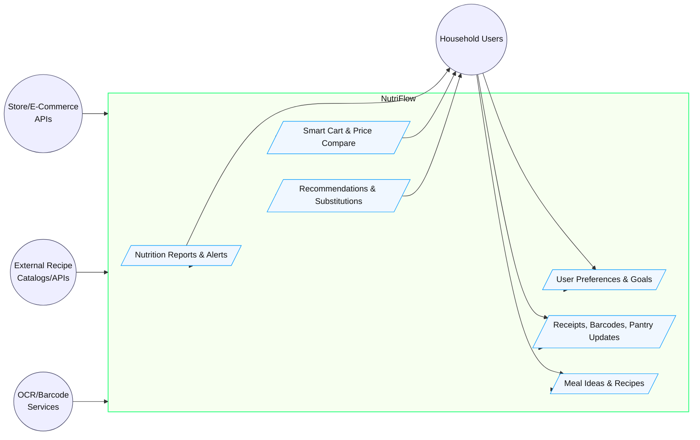
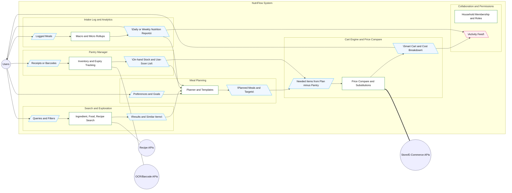

```mermaid
flowchart TB
  %% Styles
  classDef module fill:#fff,stroke:#2b8a3e,stroke-width:1.25px,color:#111
  classDef datastore fill:#fff7f0,stroke:#f90,stroke-width:1px,color:#111
  classDef actor fill:#eef,stroke:#446,stroke-width:1px,color:#111
  classDef io fill:#f0f7ff,stroke:#09f,stroke-width:1px,color:#111
  classDef alert fill:#fff0f4,stroke:#c06,stroke-width:1px,color:#111
  linkStyle default stroke:#666,stroke-width:1.1px

  %% Actors
  U((Users)):::actor
  Stores((Store APIs)):::actor
  OCR((OCR/Barcode)):::actor
  Recipes((Recipe APIs)):::actor

  %% Modules
  MP[Meal Planning]:::module
  PM[Pantry Manager]:::module
  CE[Cart Engine and Price Compare]:::module
  IX[Intake Log and Analytics]:::module
  SR[Search and Exploration]:::module
  CL[Collaboration and Permissions]:::module
  RE[Recommendation Engine]:::module
  NT[Notifications and Alerts]:::alert

  %% Data Layer - Core Entities (grouped)
  subgraph DB[Data Layer - Core Entities]
    UDB[(USER, PREFERENCES, ACTIONLOG)]:::datastore
    HH[(HOUSEHOLD, Memberships)]:::datastore
    FOODDB[(FOOD, INGREDIENT, NUTRITIONFACTS)]:::datastore
    RECIPEDB[(RECIPE, RecipeIngredient, RecipeFood)]:::datastore
    MEALDB[(MEAL, MealFood, MealRecipe)]:::datastore
    PLANDB[(MEALPLAN, MealPlanEntry)]:::datastore
    PANTRYDB[(PANTRYITEM)]:::datastore
    CARTDB[(CART, CARTITEM)]:::datastore
    STOREDB[(STORE, STOREITEM, PriceHistory)]:::datastore
    LOGDB[(INTAKELOG, IntakeLogItem, NutritionTargets)]:::datastore
  end

  %% Inputs/Outputs (explicit)
  Prefs[/User Preferences and Goals/]:::io
  Receipts[/Receipts or Barcodes/]:::io
  PlanOut[\\Planned Meals and Targets\\]:::io
  NeedOut[\\Needed Items\\]:::io
  CartOut[\\Smart Cart and Cost per Store\\]:::io
  ReportOut[\\Nutrition Reports\\]:::io
  RecoOut[\\Use-Soon and Substitutions\\]:::io

  %% Flows from Actors to Modules
  U --> Prefs --> MP
  U --> Receipts --> PM
  U --> SR
  U --> IX

  %% Module <-> Data Layer
  MP <--> UDB
  MP <--> FOODDB
  MP <--> RECIPEDB
  MP <--> MEALDB
  MP <--> PLANDB

  PM <--> PANTRYDB
  PM <--> FOODDB

  CE <--> PLANDB
  CE <--> PANTRYDB
  CE <--> STOREDB
  CE <--> CARTDB

  IX <--> LOGDB
  IX <--> PLANDB
  IX <--> FOODDB
  IX <--> RECIPEDB
  SR <--> FOODDB
  SR <--> RECIPEDB

  CL <--> UDB
  CL <--> HH

  RE <--> PLANDB
  RE <--> PANTRYDB
  RE <--> FOODDB
  RE <--> STOREDB

  %% External integrations
  PM --- OCR
  SR --- Recipes
  CE === Stores

  %% Inter-module data pipes (labels simplified for Mermaid)
  MP -->|Plan: meals; servings; dates| PlanOut
  PM -->|On-hand and expiry| NeedOut
  PlanOut --> CE
  NeedOut --> CE
  CE -->|Cart with price compare| CartOut
  IX -->|Macro and micro rollups| ReportOut
  RE -->|Use-soon and alternatives| RecoOut

  %% Outputs to user and notifications
  CartOut --> U
  ReportOut --> U
  RecoOut --> U
  RE --> NT
  IX --> NT
  CE --> NT
  NT --> U
```

# NutriFlow - Design Diagrams (Assignment #5)

Below are three Mermaid design diagrams for **NutriFlow**. A legend explains the conventions and the focus remains on inputs and outputs.

---

## Design D0 - Context (Highest-Level View)

**Project Title:** NutriFlow  
**Goal Statement:** Help households plan meals, track nutrition, and purchase ingredients at the best value while minimizing waste.

---

## Design D1 - Subsystems (Elaboration of D0)

**Project Title:** NutriFlow  
**Goal Statement:** Help households plan meals, track nutrition, and purchase ingredients at the best value while minimizing waste.

---

## Design D2 - Detailed Data Flow (Elaboration of D1)

**Project Title:** NutriFlow  
**Goal Statement:** Help households plan meals, track nutrition, and purchase ingredients at the best value while minimizing waste.

---

## Diagram Conventions

- **Rounded circles** = external actors/systems (e.g., users, store APIs, OCR, recipe APIs).
- **Rectangles** = NutriFlow modules/subsystems (e.g., Meal Planning, Pantry Manager).
- **Cylinders** = data stores/entities (e.g., RECIPE, PANTRYITEM).
- **Slanted boxes** (parallelogram style) labeled as inputs/outputs = primary inputs to/outputs from the system (e.g., Receipts, Planned Meals, Smart Cart).
- **Solid lines/arrows** = action or control flow; **dashed/double lines** indicate external integrations.
- **Arrow labels** clarify the payload moving across interfaces (e.g., “Plan (meals, servings, dates)”).

**What the diagrams depict:**  
NutriFlow ingests user preferences, pantry updates (receipts/barcodes), and recipe ideas. It plans meals, computes nutrition roll-ups, reconciles plan vs pantry to create a smart shopping cart with price comparisons, and generates alerts/recommendations. Outputs include a finalized cart (by store), nutrition reports, and timely reminders to minimize waste and hit goals.
