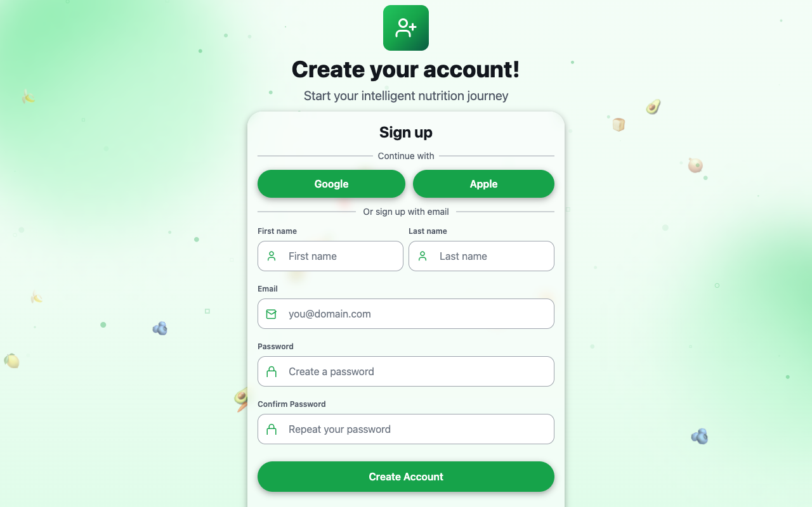

# Quickstart

This guide walks you through the core NutriFlow workflow in five steps. By the end, you will have set up your preferences, planned meals, stocked your pantry, built a shopping cart, and logged your first intake.

## 1. Create an Account

1. Open NutriFlow and click **Get Started** (or **Sign Up**).
2. Fill in your name, email, and password — or use **Continue with Google** for one-click sign-up.
3. You are now on the **Home Dashboard**.

> **Tip:** For a quick preview, use the **Demo user** or **Premium demo** buttons on the Sign In page — no account required.

## 2. Set Your Dietary Preferences

1. Navigate to **Profile** (click your name in the top-right nav bar).
2. Tap **Dietary Preferences**.
3. Select your **diet type** (e.g., Omnivore, Vegetarian, Keto).
4. Toggle any **allergens** you want to avoid.
5. Choose your preferred **food categories**.

These preferences influence recipe recommendations and filtering throughout the app.

See: [Dietary Preferences](../guides/dietary-preferences.md)

## 3. Browse Recipes & Build a Meal Plan

1. Go to the **Recipes** tab to browse and search recipes.
2. Use filters like difficulty, source (local or Spoonacular), and "From My Pantry" to narrow results.
3. Open any recipe and click **Add to Meal Plan** to schedule it.
4. Visit the **Meal Plan** tab to see your weekly calendar and rearrange meals as needed.

See: [Recipes](../guides/recipes.md) and [Meal Plans](../guides/meal-plans.md)

## 4. Stock Your Pantry & Generate a Cart

1. Go to the **Pantry** tab and add items you already have at home.
2. Navigate to **Shopping** to build a grocery cart.
3. Connect your Kroger account (via **Profile > Kroger**) to see real product prices and availability.
4. Use **Regenerate** to auto-build a cart from your meal plan, minus what is already in your pantry.

See: [Pantry](../guides/pantry.md) and [Shopping & Cart](../guides/shopping.md)

## 5. Log Your Intake & Track Progress

1. Return to the **Home Dashboard** each day.
2. Use the **Intake Log** section to log foods you have eaten.
3. Watch your calorie ring and macro bars fill up toward your daily goals.
4. Visit **Insights** for weekly trends, streaks, and spending analytics.

See: [Intake Log](../guides/intake-log.md) and [Home Dashboard](../guides/home.md)

---

**Optional: Create or Join a Household (Premium)**

If you plan meals with family or roommates, go to **Profile > Household** to create or join a household. Household members share meal plans, pantry, and cart access.

See: [Households](../guides/households.md)
