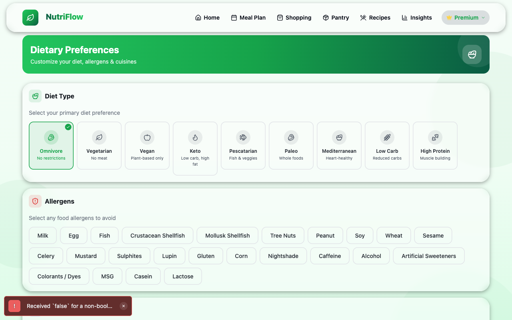
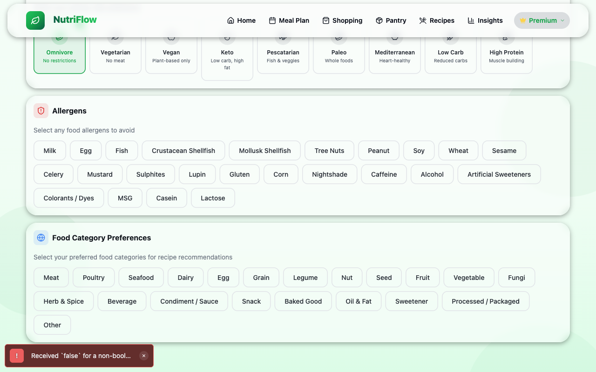

# Dietary Preferences

The Dietary Preferences screen lets you tell NutriFlow about your diet, allergens, and food interests. These settings influence recipe recommendations and filtering throughout the app.

To get here: **Profile > Dietary Preferences**

## Diet Type

Select your primary diet from nine options:

| Diet | Description |
|---|---|
| **Omnivore** | No restrictions |
| **Vegetarian** | No meat |
| **Vegan** | Plant-based only |
| **Keto** | Low carb, high fat |
| **Pescatarian** | Fish & veggies |
| **Paleo** | Whole foods |
| **Mediterranean** | Heart-healthy |
| **Low Carb** | Reduced carbs |
| **High Protein** | Muscle building |

Only one diet type can be selected at a time. The selected option shows a green border and checkmark badge.

## Allergens

Toggle any food allergens you need to avoid. NutriFlow supports 24 allergen categories:

Milk, Egg, Fish, Crustacean Shellfish, Mollusk Shellfish, Tree Nuts, Peanut, Soy, Wheat, Sesame, Celery, Mustard, Sulphites, Lupin, Gluten, Corn, Nightshade, Caffeine, Alcohol, Artificial Sweeteners, Colorants/Dyes, MSG, Casein, Lactose

Selected allergens appear as highlighted chips. The card header shows how many allergens you have selected.

## Food Category Preferences

Select the food categories you enjoy to help NutriFlow recommend relevant recipes:

Meat, Poultry, Seafood, Dairy, Egg, Grain, Legume, Nut, Seed, Fruit, Vegetable, Fungi, Herb & Spice, Beverage, Condiment/Sauce, Snack, Baked Good, Oil & Fat, Sweetener, Processed/Packaged, Other

## Saving Changes

When you make any change, a **Save** button appears at the bottom of the screen with a spring animation. Tap it to persist your preferences. A success toast confirms the save.

If you navigate away without saving, your changes are discarded.

## Related

- [Profile & Goals](profile.md)
- [Recipes](recipes.md) (preferences influence recipe recommendations)
- [FAQ](../help/faq.md)
