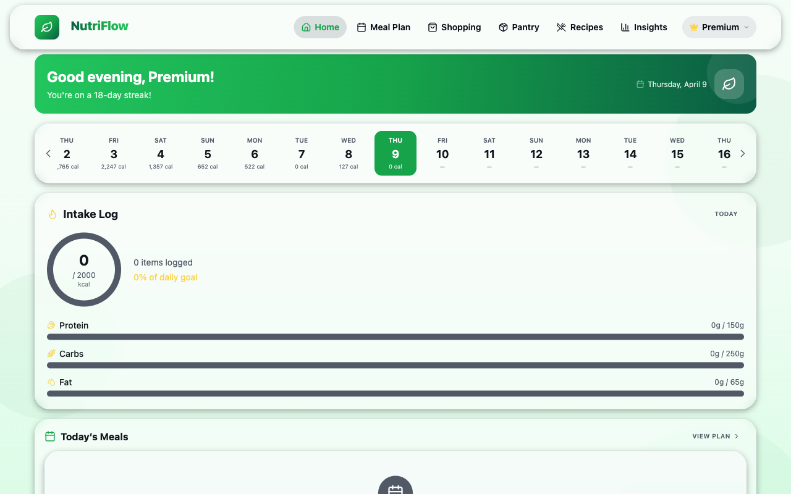
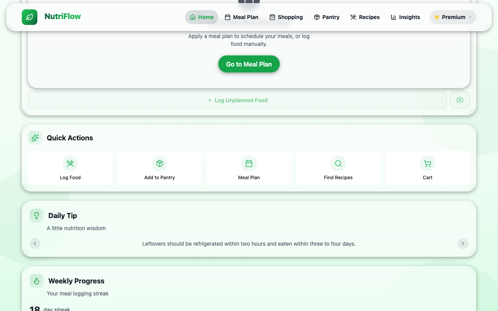

# Home Dashboard

The Home Dashboard is your daily command center in NutriFlow. It provides an at-a-glance summary of your nutrition progress, quick shortcuts to common actions, and motivational widgets.

## Welcome Banner

At the top of the page, a personalized greeting shows:

- **Time-of-day greeting** (Good morning / Good afternoon / Good evening) and your first name
- **Today's date**
- **Your current streak** (number of consecutive days you have logged meals)

## Date Navigator

A horizontal calendar strip lets you browse day by day. Each day shows the total calories logged. Tap any day to see its intake details. The current day is highlighted in green.

## Intake Log

The central widget on the dashboard displays today's nutrition at a glance:

- A **calorie ring** showing consumed vs. daily goal (e.g., 0 / 2000 kcal)
- **Macro progress bars** for Protein, Carbs, and Fat, each showing grams consumed vs. target
- A count of items logged today

## Today's Meals

Below the intake log, a section shows planned meals for today (pulled from your active meal plan). If no meals are planned, a prompt encourages you to visit the Meal Plan screen. You can also tap **+ Log Unplanned Food** to log something outside your plan.

## Quick Actions

Five shortcut buttons give instant access to common tasks:

| Action | What it does |
|---|---|
| **Log Food** | Opens the food logging sheet and scrolls to the Intake Log |
| **Add to Pantry** | Navigates to the Pantry page |
| **Meal Plan** | Navigates to the Meal Plan calendar |
| **Find Recipes** | Navigates to the Recipes browser |
| **Cart** | Navigates to the Shopping / Cart page |

## Daily Tip

A rotating carousel of nutrition and wellness tips. Use the left/right arrows to browse tips.

## Weekly Progress

Shows your current meal-logging streak (e.g., "18 day streak") and visual weekly progress indicators.

## Related

- [Intake Log](intake-log.md)
- [Meal Plans](meal-plans.md)
- [Recipes](recipes.md)
