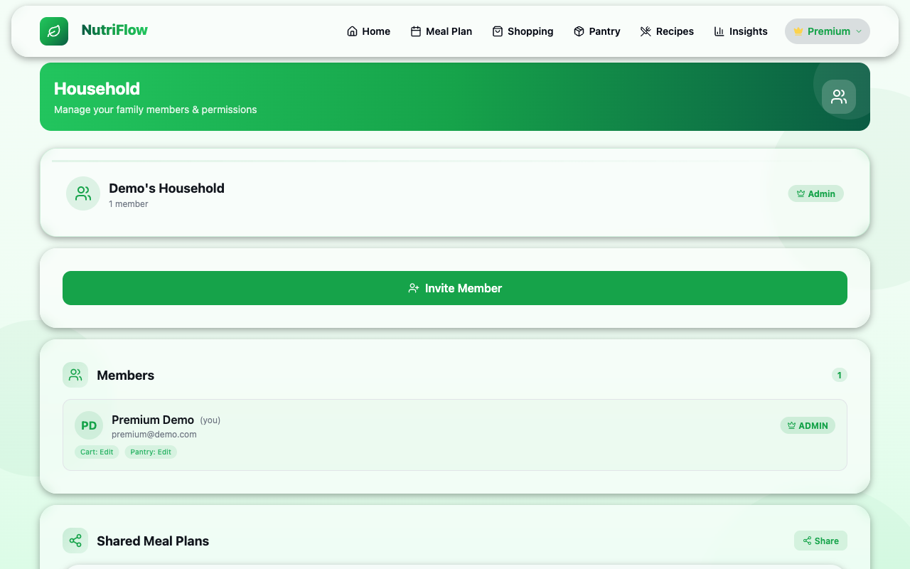
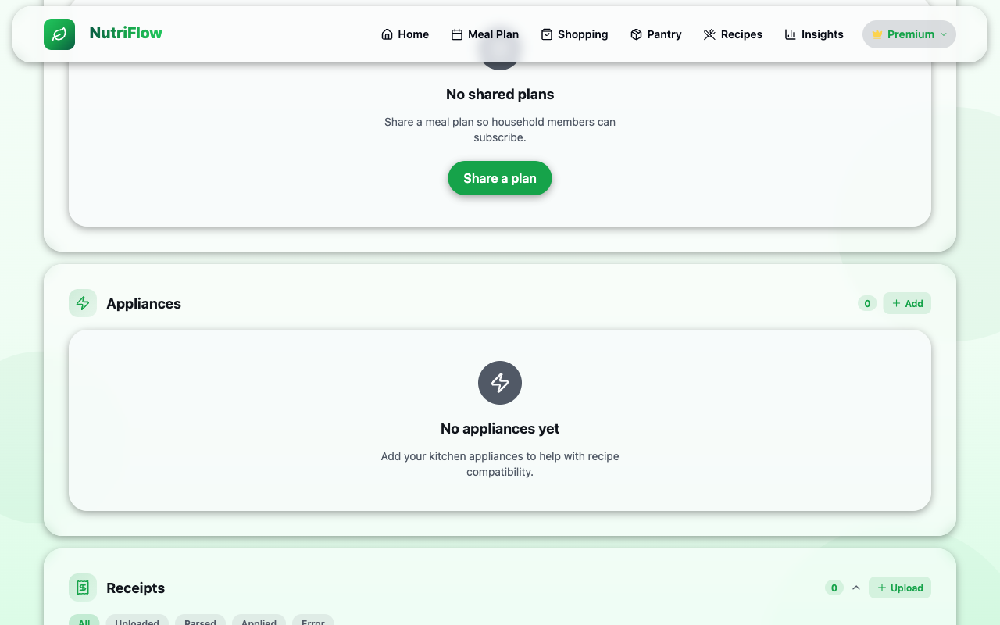

# Households

Households let you collaborate with family members or roommates on meal planning, pantry management, and grocery shopping. This is a **Premium** feature — free-tier users see an upgrade prompt.

To get here: **Profile > Household**

## Creating a Household

1. Navigate to **Profile > Household**.
2. In the **Create Household** card, enter a name for your household.
3. Tap **Create**.

You are automatically assigned the **Admin** role.

## Joining a Household

If someone has already created a household:

1. Ask the admin for the **Household ID**.
2. In the **Join Household** card, paste the ID.
3. Tap **Join**.

A user can belong to only one household at a time.

## Members & Roles

The **Members** section lists everyone in the household. Each member shows:

- Name and email
- Role badge (**ADMIN** or **MEMBER**)
- Permission tags (e.g., "Cart: Edit", "Pantry: Edit")

### Roles

| Role | Capabilities |
|---|---|
| **Admin** | Full control — manage members, change permissions, rename or delete the household |
| **Member** | Standard access — view and contribute to shared resources |

### Permissions

Admins can toggle per-member permissions:

- **Cart: Edit** — can add, remove, and modify cart items
- **Pantry: Edit** — can add, remove, and modify pantry items

## Inviting Members

1. Tap the **Invite Member** button.
2. Enter the person's email address or share the household ID.
3. They will receive an invitation to join.

## Shared Meal Plans

Household members can share meal plan templates:

1. Tap the **Share** button in the Shared Meal Plans section.
2. Select a saved meal plan to share with the household.
3. Other members can view and apply shared plans to their own calendar.

## Appliances

The **Appliances** section lets you list kitchen appliances your household owns (e.g., air fryer, slow cooker, instant pot). This information helps NutriFlow recommend recipes that match your available equipment.

Tap **+ Add** to add an appliance.

## Receipts

Upload grocery receipt photos to track household spending. Receipts go through a processing pipeline:

- **Uploaded** — photo received
- **Parsed** — items extracted from the receipt
- **Applied** — items added to spending records
- **Error** — parsing failed (try a clearer photo)

Filter receipts by status using the tabs: All, Uploaded, Parsed, Applied, Error.

## Leaving or Deleting a Household

- **Members** can leave a household from the household settings.
- **Admins** can delete the household entirely (this removes all members).

## Related

- [Profile & Goals](profile.md)
- [Meal Plans](meal-plans.md)
- [Pantry](pantry.md) (shared pantry)
- [Shopping & Cart](shopping.md) (shared cart)
