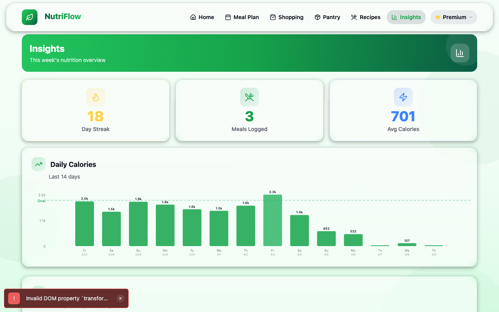
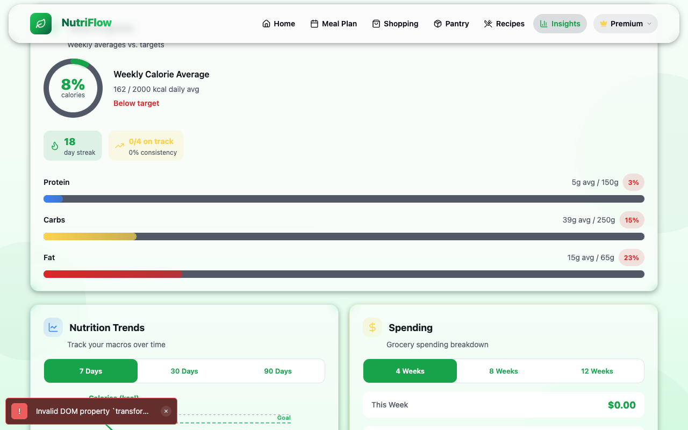

# Insights

The Insights page provides a weekly overview of your nutrition progress, goal tracking, trend charts, and spending analytics. It helps you understand patterns and stay motivated.

## Weekly Summary

Three cards at the top show your key stats for the current week:

| Metric | Description |
|---|---|
| **Day Streak** | Number of consecutive days with at least one logged meal |
| **Meals Logged** | Total intake log entries this week |
| **Avg Calories** | Average daily calorie intake for the week |

## Daily Calories Chart

A bar chart shows your calorie intake for each of the last 14 days. A dashed **Goal** line indicates your daily calorie target. Bars above the goal line mean you exceeded your target; bars below mean you came in under.

Each bar is labeled with the day of the week and date. Hover over (or tap) a bar to see the exact calorie count.

## Goal Progress

The Goal Progress card compares your weekly averages against your daily targets:

- A **calorie ring** shows the weekly average as a percentage of your goal (e.g., "8% — Below target")
- **Streak** and **consistency** stats show how regularly you are hitting your targets
- **Macro progress bars** for Protein, Carbs, and Fat display your average intake vs. goal with percentage badges

Color coding:
- **Blue** — Protein
- **Yellow** — Carbs
- **Red** — Fat

## Nutrition Trends

The Nutrition Trends card shows a line chart of your macro intake over time. Toggle between:

- **7 Days** — the past week
- **30 Days** — the past month
- **90 Days** — the past three months

This helps you spot patterns like consistently under-eating protein or over-consuming fats.

## Spending

The Spending card tracks your grocery spending based on cart data. Toggle between:

- **4 Weeks** — the past month
- **8 Weeks** — the past two months
- **12 Weeks** — the past quarter

The card shows spending for "This Week" with a running total. This helps you stay within a grocery budget.

## Related

- [Home Dashboard](home.md) (daily view of the same metrics)
- [Profile & Goals](profile.md) (to change calorie and macro targets)
- [Shopping & Cart](shopping.md) (spending data source)
