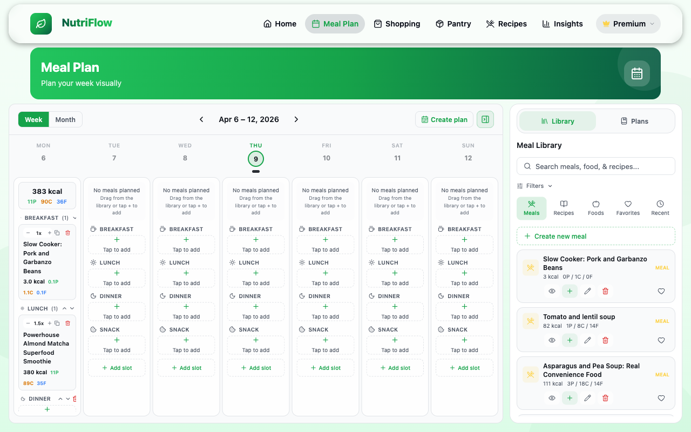

# Meal Plans

The Meal Plan screen is a weekly calendar where you schedule what to eat each day. It supports drag-and-drop rearrangement, a recipe/meal library side panel, and saved plan templates.

## Calendar View

The main area shows a **week view** with columns for each day (Monday through Sunday). Each day is divided into four meal slots:

- **Breakfast**
- **Lunch**
- **Dinner**
- **Snack**

Planned items appear as cards within each slot, showing the recipe or meal name and a calorie summary. At the top of each day column, you can see the total planned calories and macros.

### Navigating Weeks

Use the left/right arrows at the top of the calendar to move between weeks. The current week's date range is displayed (e.g., "Apr 6 – 12, 2026").

## Adding Items to the Calendar

There are several ways to add meals or recipes to your plan:

1. **From the Meal Library side panel** — Click the **Library** button to open a side panel with your saved meals, foods, and recipes. Drag items from the library onto the calendar.
2. **From the Recipes page** — When viewing a recipe, click **Add to Meal Plan** and choose a day and slot.
3. **Directly on the calendar** — Click an empty slot to open an item picker.

## Rearranging Items

Drag and drop items between slots or days to rearrange your plan. This works on both web and mobile (using platform-specific drag-and-drop providers).

## Saved Meal Plans

You can save an entire week's plan as a **template** for reuse:

1. Click **Create plan** at the top of the calendar.
2. Name your plan and review its contents.
3. Save it.

To apply a saved plan to a future week:

1. Open the **Saved Plans** panel (via the Library side panel).
2. Select a plan and click **Apply**.
3. Choose the target date range.

## Sharing Plans (Household)

Premium household members can share meal plans with their household. Shared plans appear in the household's **Shared Meal Plans** section, where other members can subscribe to or apply them.

## Related

- [Recipes](recipes.md)
- [Shopping & Cart](shopping.md)
- [Households](households.md)
- [Home Dashboard](home.md)
