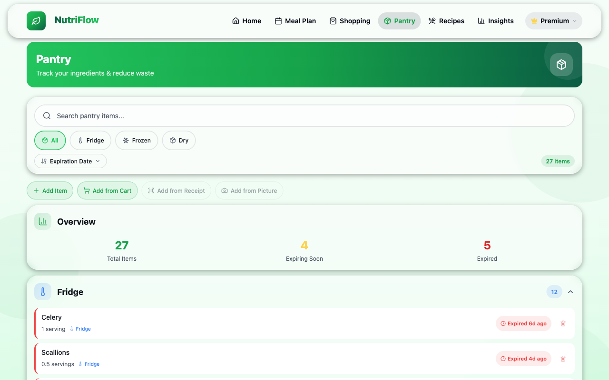

# Pantry

The Pantry tracks what ingredients you have at home. NutriFlow uses pantry data to filter recipes by what you can make, subtract on-hand items when generating shopping carts, and warn you about expiring food.

## Overview Card

At the top of the Pantry page, a summary card shows three key metrics:

- **Total Items** — how many items are in your pantry
- **Expiring Soon** — items that will expire within the next few days (shown in yellow)
- **Expired** — items past their expiration date (shown in red)

## Storage Groups

Items are organized into three collapsible sections based on where they are stored:

- **Fridge** (refrigerated items)
- **Frozen** (freezer items)
- **Dry** (dry storage / pantry shelf items)

Each group header shows the item count. Tap the header to expand or collapse the group.

## Pantry Item Details

Each item row shows:

- **Name**
- **Quantity** and unit (e.g., "1 serving", "0.5 servings")
- **Storage type** badge (Fridge / Frozen / Dry)
- **Expiration status** — color-coded badge:
  - **Green** — fresh, plenty of time remaining
  - **Yellow** — expiring soon
  - **Red** — expired (e.g., "Expired 6d ago")
  - **Gray** — no expiration date set
- **Delete** button (trash icon) to remove the item

## Searching and Filtering

Use the controls above the pantry list to find specific items:

- **Search bar** — type to filter items by name
- **Storage filter chips** — tap **All**, **Fridge**, **Frozen**, or **Dry** to show only items in that storage type
- **Sort dropdown** — sort by expiration date (default), name, or quantity

## Adding Items

There are four ways to add items to your pantry:

| Method | Description |
|---|---|
| **+ Add Item** | Manually create a pantry item with name, quantity, unit, storage type, and expiration date |
| **Add from Cart** | Import items directly from your shopping cart after a grocery trip |
| **Add from Receipt** | Upload a grocery receipt photo for assisted entry |
| **Add from Picture** | Take a photo of food items for assisted entry |

### Adding an Item Manually

1. Tap **+ Add Item**.
2. Enter the item name.
3. Set the quantity and unit.
4. Choose a storage medium (Fridge / Frozen / Dry).
5. Optionally set an expiration date.
6. Tap **Save**.

### Adding from Cart

After a shopping trip, tap **Add from Cart** to import purchased items from your shopping cart directly into the pantry. This saves time by pre-filling item details.

## Expiry Warnings

NutriFlow displays expiration badges on every pantry item. Items that are expired or expiring soon are sorted to the top by default, making it easy to use them first and reduce waste.

## Related

- [Shopping & Cart](shopping.md) (for importing cart items into the pantry)
- [Recipes](recipes.md) (for "From My Pantry" recipe filtering)
- [Households](households.md) (shared pantry for household members)
- [FAQ](../help/faq.md)
