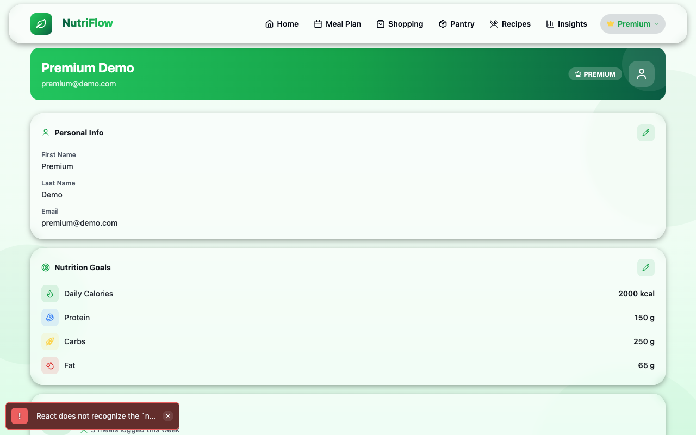
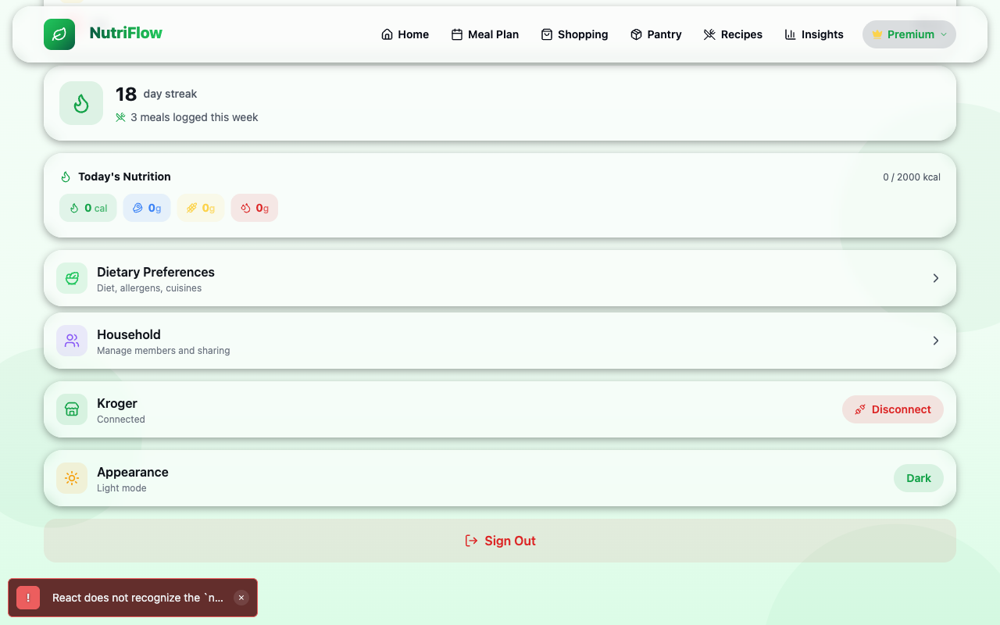

# Profile & Goals

The Profile screen is your settings hub. From here you can edit personal information, set nutrition goals, manage integrations, and navigate to sub-settings like dietary preferences and household.

## Profile Header

The header banner displays your full name, email, and account tier badge (**FREE** or **PREMIUM**). Premium users see a gold crown icon.

## Personal Info

The **Personal Info** card shows your first name, last name, and email (read-only). To edit:

1. Tap the **pencil icon** in the top-right corner of the card.
2. Edit your first and/or last name.
3. Tap the **checkmark** to save, or the **X** to cancel.

## Nutrition Goals

The **Nutrition Goals** card displays your daily targets:

| Goal | Unit |
|---|---|
| Daily Calories | kcal |
| Protein | grams |
| Carbs | grams |
| Fat | grams |

To change your goals:

1. Tap the **pencil icon** on the Nutrition Goals card.
2. Adjust the values.
3. Tap the **checkmark** to save.

These goals drive the calorie ring and macro bars on the [Home Dashboard](home.md) and the target lines in [Insights](../reference/concepts.md).

## Activity Summary

Below your goals, you'll see:

- **Streak count** — consecutive days with logged meals
- **Meals logged this week** — how many intake entries you have made
- **Today's Nutrition** — quick macro pills showing today's calories, protein, carbs, and fat

## Navigation Cards

Tappable rows link to sub-settings:

| Card | Description |
|---|---|
| **Dietary Preferences** | Set diet type, allergens, and food category preferences |
| **Household** | Create or join a household (Premium feature) |

See: [Dietary Preferences](dietary-preferences.md) and [Households](households.md)

## Kroger Integration

The **Kroger** card shows your connection status:

- **Connected** — a green badge with a "Disconnect" button
- **Disconnected** — a "Connect" button that opens the Kroger OAuth flow

Connecting to Kroger enables real product data (names, prices, images) in the [Shopping & Cart](shopping.md) page.

## Appearance

Toggle between **Light mode** and **Dark mode** using the appearance card. The setting applies immediately across the entire app.

## Sign Out

At the bottom of the Profile page, the **Sign Out** button logs you out. A confirmation dialog appears before signing out to prevent accidental logouts.

## Related

- [Dietary Preferences](dietary-preferences.md)
- [Households](households.md)
- [Shopping & Cart](shopping.md) (Kroger integration)
- [Home Dashboard](home.md)
