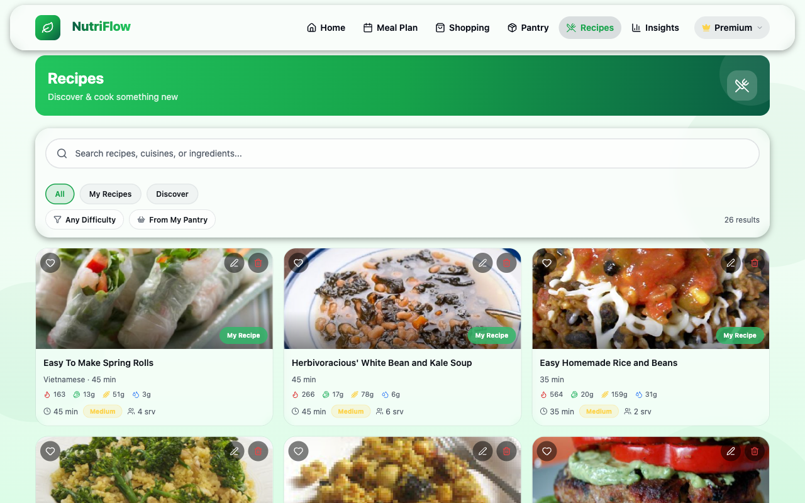

# Recipes

The Recipes screen lets you discover, search, and manage recipes. NutriFlow includes both user-created (local) recipes and a large catalog of recipes from Spoonacular.

## Browsing Recipes

When you open the **Recipes** tab, you see a grid of recipe cards. Each card shows:

- Recipe image
- Name
- Cook time
- Difficulty level
- Cuisine type
- Macro summary (calories, protein, carbs, fat)

Recipes load in pages of 20. Scroll down to load more.

## Searching and Filtering

### Search Bar

Type keywords into the search bar at the top to find recipes by name, cuisine, or ingredients. The search updates automatically as you type (with a short delay for responsiveness).

### Filters

Use the filter bar below the search to narrow results:

| Filter | Options |
|---|---|
| **Source** | My Recipes, Discover (Spoonacular) |
| **Difficulty** | Easy, Medium, Hard |
| **From My Pantry** | Toggle on to show only recipes you can make with ingredients currently in your pantry |

## Viewing a Recipe

Tap any recipe card to open the **Recipe Detail Modal**, which shows:

- Full-size image
- Ingredients list with quantities
- Step-by-step instructions
- Nutritional information per serving
- An **Add to Meal Plan** button that opens a slot picker to schedule the recipe on your calendar

## Creating a Recipe

1. Tap the **+** button (top-right of the Recipes page).
2. Fill in the recipe details:
   - **Name** — a descriptive title
   - **Instructions** — step-by-step directions
   - **Ingredients** — search and add ingredients with quantities
   - **Cook time** and **servings**
   - **Difficulty** (Easy / Medium / Hard)
   - **Cuisine** type
3. Tap **Save**.

Your custom recipe appears under **My Recipes** and can be added to meal plans.

## Deleting a Recipe

Open a recipe you created, then tap the delete option. A confirmation dialog ensures you do not delete recipes accidentally. Only recipes you created can be deleted — Spoonacular recipes are read-only.

## Related

- [Meal Plans](meal-plans.md)
- [Pantry](pantry.md) (for pantry-based filtering)
- [Shopping & Cart](shopping.md)
