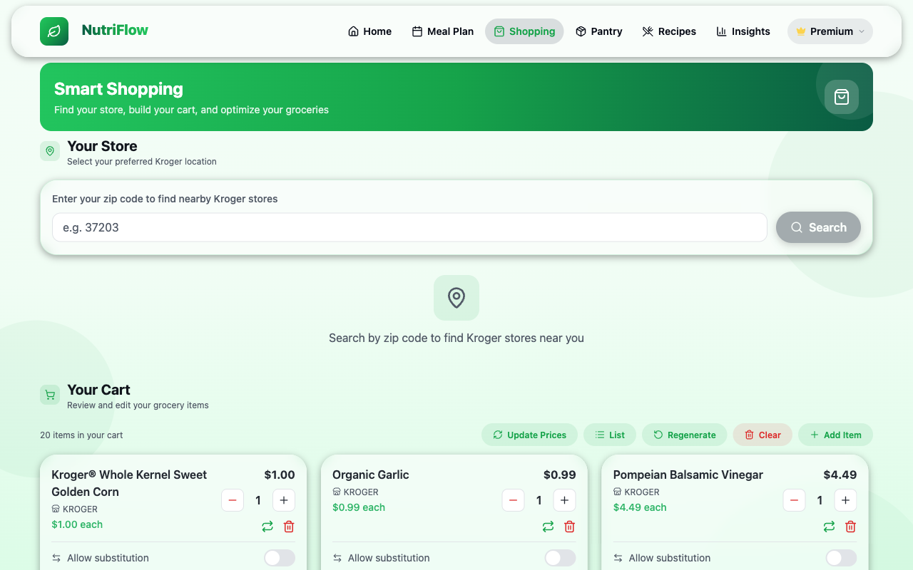
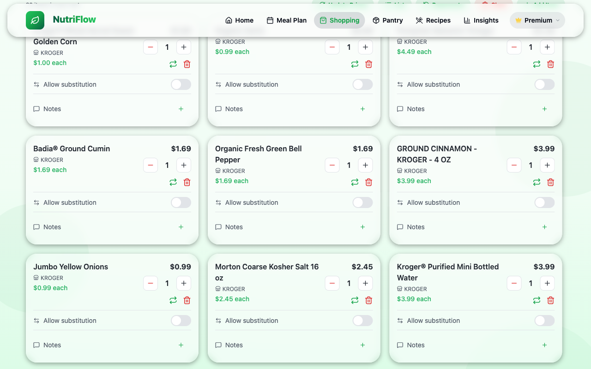

# Shopping & Cart

The Shopping page is your grocery planning hub. It combines a store finder, a smart cart builder, and Kroger integration into a single screen.

## Store Finder

At the top of the Shopping page, the **Your Store** section lets you find and select a nearby Kroger location:

1. Enter your zip code in the search box.
2. Click **Search** to see nearby Kroger stores.
3. Each result shows the store address, phone number, and hours.
4. Select a store to set it as your preferred location.

Your preferred store is saved locally, so you only need to set it once.

## Your Cart

Below the store finder, the **Your Cart** section displays all items in your current shopping cart.

### Cart Item Cards

Each item card shows:

- **Product name** and brand
- **Price** (from Kroger)
- **Quantity** controls (- / +) to adjust how many you need
- **Allow substitution** toggle — lets Kroger substitute a similar product if this one is unavailable
- **Notes** — add special instructions for this item
- **Swap** button — search the Kroger catalog for an alternative product

### Cart Actions

The toolbar above the cart items provides:

| Action | Description |
|---|---|
| **Update Prices** | Refresh prices from Kroger for all items |
| **List** | Toggle between card and list view |
| **Regenerate** | Rebuild the cart from your active meal plan (subtracting pantry items) |
| **Clear** | Remove all items from the cart |
| **+ Add Item** | Manually search for and add a Kroger product |

### Generating a Cart from Your Meal Plan

The **Regenerate** button builds a cart automatically:

1. NutriFlow looks at meals scheduled in your current meal plan.
2. It calculates the required ingredients.
3. Items already in your pantry are subtracted.
4. Remaining ingredients are matched to Kroger products.
5. The cart is populated with real products, prices, and quantities.

This is the recommended workflow: plan meals first, then generate a cart.

## Kroger Integration

NutriFlow connects to Kroger for real product data. To set up:

1. Go to **Profile**.
2. In the **Kroger** card, click **Connect**.
3. Authorize NutriFlow via Kroger's OAuth flow.
4. Once connected, the Shopping page pulls real product names, prices, and images.

You can disconnect at any time from the Profile page.

## Related

- [Meal Plans](meal-plans.md) (to plan meals before generating a cart)
- [Pantry](pantry.md) (pantry items are subtracted from generated carts)
- [Profile & Goals](profile.md) (for Kroger connection)
