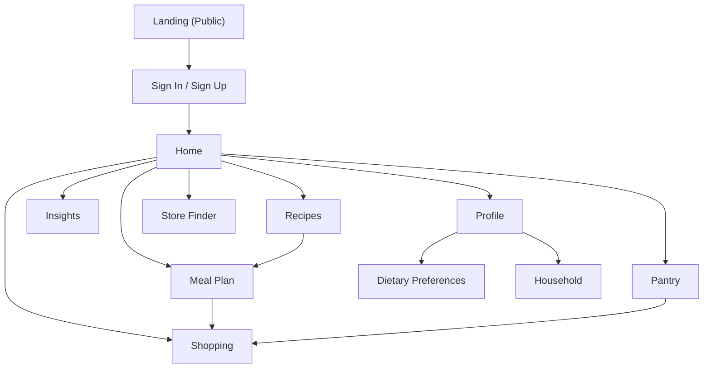

## NutriFlow Project Description

### Team Members

- **Randy Hucker**
  - Major: Computer Science
  - Email: [randalhucker@gmail.com](mailto:randalhucker@gmail.com)
  - [LinkedIn](https://www.linkedin.com/in/randy-hucker)

- **Sam Graler**
  - Major: Computer Science
  - Email: [gralersm@mail.uc.edu](mailto:gralersm@mail.uc.edu)
  - [LinkedIn](https://www.linkedin.com/in/sam-graler)

### Project Faculty/Industry Advisor

- **Dr. William Hawkins**
  - Assistant Professor of Computer Science, University of Cincinnati
  - Email: [hawkinwh@ucmail.uc.edu](mailto:hawkinwh@ucmail.uc.edu)
  - [LinkedIn](https://www.linkedin.com/in/whh3/)

---

### Project Topic Area

**Intelligent Food Ecosystem** — A cross-platform nutrition and meal-planning experience that connects meal planning, pantry awareness, shopping workflows, and personalized dietary preferences into one cohesive application.

---

### Project Abstract (Expanded)

**Problem Statement**: Many people want to eat healthier and waste less food, but meal planning, grocery shopping, and tracking what is already at home are often handled across multiple disconnected apps. This fragmentation makes it harder to follow a plan, avoid duplicate purchases, and maintain consistent nutrition habits—especially for shared households.

**Abstract**: NutriFlow addresses the difficulty of planning healthy, affordable meals by bringing recipes, nutrition guidance, pantry awareness, and household coordination into one cohesive experience. By helping users turn meal ideas into actionable plans and organized shopping lists, NutriFlow supports smarter decisions from selecting meals to stocking the kitchen reducing friction, saving time, and improving consistency day to day.
---

### Inadequacy of Current Solutions

- **Nutrition trackers** often prioritize manual logging and calorie counting rather than proactive planning workflows (meal plan → pantry → shopping).
- **Recipe apps** help discovery but commonly lack tight integration with meal planning, household coordination, and grocery workflows.
- **Shopping list apps** manage items well, but typically do not incorporate nutrition context, dietary constraints, or meal-plan alignment.

NutriFlow’s goal is to reduce friction by **connecting meal planning, pantry awareness, and shopping lists** behind a single account and consistent UI across devices.

---

### Final Application Scope

**Core authenticated screens implemented**:
- **Home**: daily overview widgets (intake log entry point, tips, streak/progress, expiring pantry items).
- **Meal Plan**: meal planning shell and planning workflow entry points.
- **Shopping**: shopping list management (cart flow is routed through shopping in the current build).
- **Pantry**: pantry inventory management shell.
- **Recipes**: recipe browsing and meal-planning integration points.
- **Insights**: insights dashboard shell.
- **Profile**: account hub, with links to dietary preferences and household.
- **Dietary Preferences**: diet type, allergens, and food category preferences.
- **Household**: household management screen.
- **Store Finder**: store lookup screen.

**Public + auth flows**:
- **Landing (public)**: product overview and navigation to authentication.
- **Sign-in / Sign-up (auth)**: account access flows.

---

### Technical Background (Final Implementation)

NutriFlow’s final implementation emphasizes **cross-platform UI**, **typed API integration**, and **secure authentication**:

- **Frontend**: Expo + React Native + TypeScript, with **Expo Router** for file-based routing.
- **UI**: Gluestack UI + NativeWind (Tailwind-style utility classes), light/dark theme support.
- **Auth**: token-based authentication with secure storage on device (and web storage on web).
- **API contract**: ts-rest + Zod schemas via `@randalhucker/nutriflow-contract`, with **TanStack React Query** for caching and request state.

---

### High-Level User Interface Flow

---

### Team Approach

- **Iterative development**: build the navigation and core pages first, then layer in data fetching, polish, and UX improvements (loading states, error handling, responsiveness).
- **User-centered UI implementation**: focus on consistent navigation and clear “daily workflows” (plan meals, manage pantry, build shopping list).
- **Strong typing and validation**: align client behavior to shared schemas/contract to reduce integration defects and keep the frontend stable as the API evolves.
