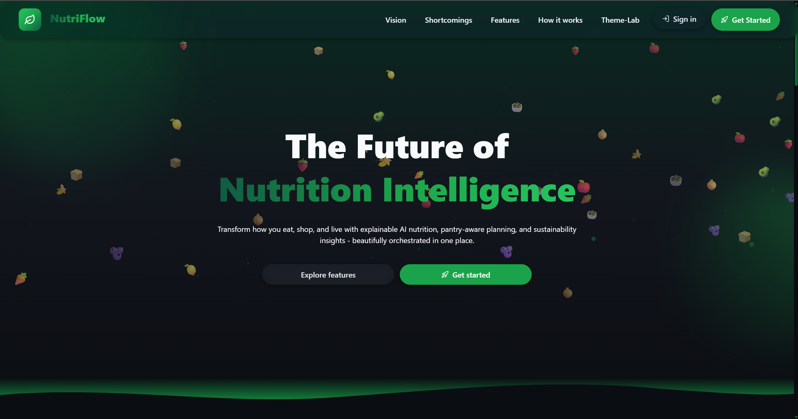
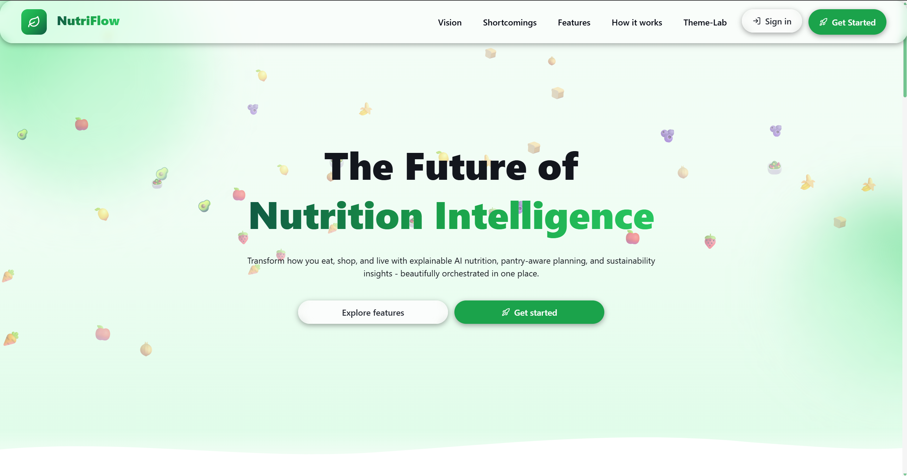
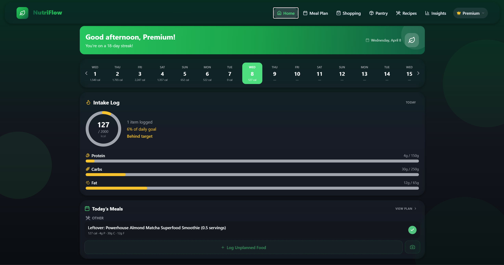
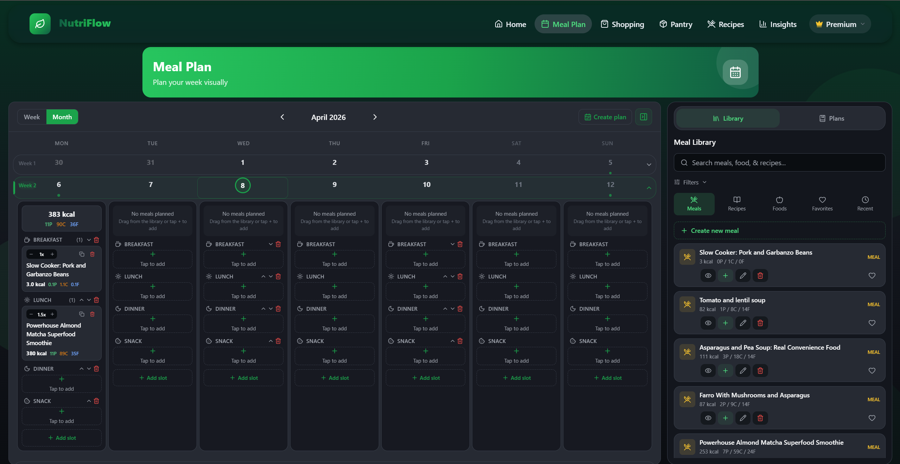
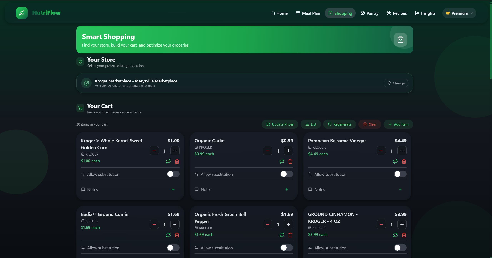
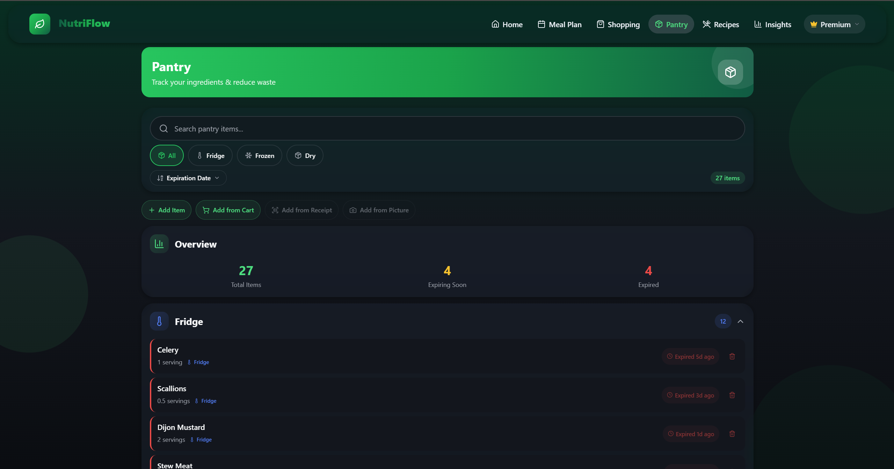
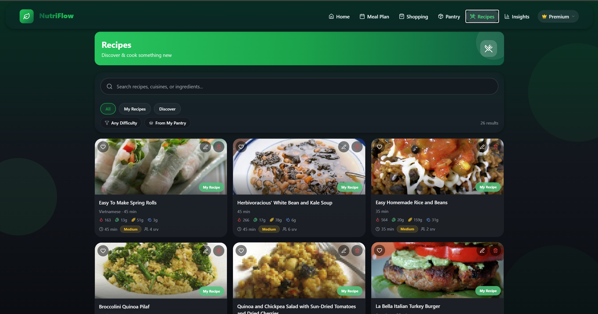
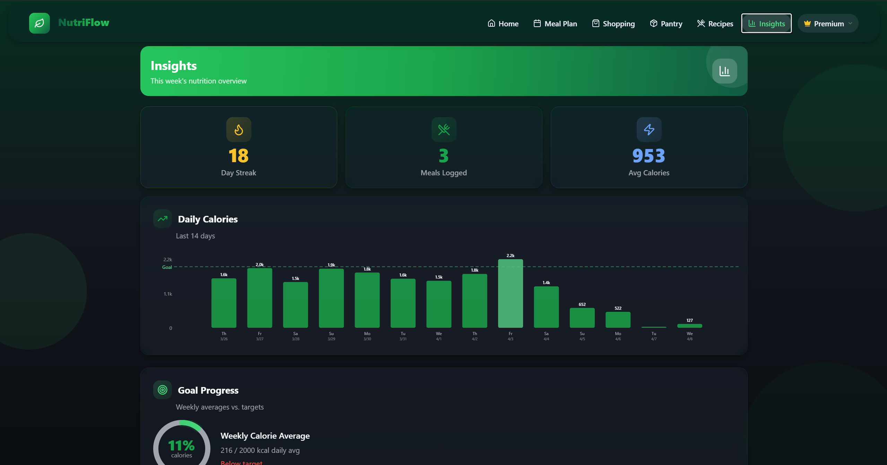

## User Interface Specification (NutriFlow)

### Overview
NutriFlow is a cross-platform (mobile-first) nutrition and meal-planning application designed to help users plan meals, manage groceries, and track household food inventory. The UI is optimized for quick daily use, clear navigation, and accessible presentation of nutrition and planning information.

### UI Goals
- **Clarity**: Present core actions (plan, shop, cook, track) with minimal cognitive load.
- **Speed**: Enable common tasks in a few taps (add items, view plan, check pantry).
- **Consistency**: Reuse common UI patterns (cards, lists, forms, toasts, tabs).
- **Accessibility**: Maintain readable typography, sufficient contrast, and predictable layouts.
- **Responsiveness**: Support iOS/Android and web with consistent visual structure.

### Target Users
- Individuals who want lightweight meal planning and grocery organization.
- Fitness-focused individuals who want a high degree of flexibility and customization
- Households coordinating shopping and pantry inventory.
- Users with dietary preferences or restrictions who want tailored decisions.

---

## Navigation & Information Architecture

### Route Groups / App Areas
NutriFlow is organized into three top-level experiences:

- **Public (Unauthenticated)**
  - Landing / marketing overview
  - Optional “theme” or demo areas (if present)

- **Auth (Authentication Flow)**
  - Sign in
  - Sign up
  - Redirect handling (web/native as needed)

- **Main (Authenticated Application)**
  - Home (dashboard-style entry)
  - Recipes
  - Meal Plan
  - Shopping
  - Cart
  - Pantry
  - Insights
  - Profile
  - Household
  - Dietary Preferences
  - Store Finder

### Primary Navigation Pattern
- **Bottom tab navigation** (mobile) is the primary mechanism for switching between core sections.
- **Stack navigation** within sections is used for “drill-down” pages (details, edit flows).
- **Web layout constraints**: content is displayed with a minimum usable width to keep layouts readable and reduce awkward wrapping.

---

## Visual Design System

### Design Principles
- **Modern, clean UI** with content grouped into cards and sections.
- **Semantic color tokens** (e.g., background, text, accent, success/warning/error).
- **Light/Dark mode** support to improve readability in different environments.
- **Consistent spacing scale** and typography for predictable scanning.

### Theming
- Theme is controlled centrally via a theme provider and applied across screens.
- Dark mode follows a class-based strategy on web and synchronizes theme state across UI libraries.

### Common UI Building Blocks
- **Buttons**: primary/secondary/tertiary styles; disabled/loading states.
- **Text inputs & form controls**: labeled, validated, error states displayed inline.
- **Cards**: used for recipes, meal plan items, insights summaries, and list groupings.
- **Lists**: shopping list, pantry items, recipe results, household members.
- **Badges/Chips**: dietary tags, categories, status indicators.
- **Toasts**: feedback for actions (saved, added, error).
- **Empty states**: clear prompts and CTAs when there is no data (no recipes, empty pantry, etc.).
- **Loading states**: spinners/skeletons for async data fetches.

---

## Screen Specifications (High-Level)

### 1) Landing (Public)
**Purpose**: Explain NutriFlow value proposition and guide user to authentication.

**Primary actions**:
- Sign in
- Sign up

**Key UI elements**:
- Hero section, feature highlights, and CTA buttons.

### 2) Sign In / Sign Up (Auth)
**Purpose**: Account access and onboarding.

**Primary actions**:
- Sign in with credentials
- Create account (sign up)
- Navigate between sign-in/sign-up

**Key UI elements**:
- Form fields with validation
- Error messaging for invalid credentials
- Loading state on submission

### 3) Home (Main)
**Purpose**: Intake log and quick overview/shortcuts into planning/shopping/pantry.

**Primary actions**:
- Log food consumed and view intake log
- View today/this week plan
- Jump to shopping list/cart
- Jump to pantry status

**Key UI elements**:
- Intake log
- Summary cards
- Quick actions (buttons)

### 4) Recipes
**Purpose**: Browse/view recipes and move toward planning or shopping.

**Primary actions**:
- Search/browse recipes
- View recipe details
- Sort entries by pantry ingredient matching
- Add to meal plan / shopping list (where supported)

**Key UI elements**:
- Search bar/filter controls
- Recipe list cards (title, image/thumbnail, time, tags)
- Recipe detail view with ingredients and steps

### 5) Meal Plan
**Purpose**: Organize meals across days.

**Primary actions**:
- View plan by week/month
- Add meals, recipes, and foods to slots across days
- Edit/remove planned items
- Create repeatable meal plans

**Key UI elements**:
- Calendar
- Planned meal cards (from drag and drop sidebar)
- Edit controls (menus or inline actions)

### 6) Shopping
**Purpose**: Manage grocery list derived from plans and manual additions.

**Primary actions**:
- Select store and generate cart from meal plan
- Add/remove items
- Check off items
- Organize by category/store (if present)
- Send cart items to Kroger cart

**Key UI elements**:
- Store selector
- Cart display
- Cart optimization section

### 7) Pantry
**Purpose**: Track what the household currently has to reduce waste and duplicate buys.

**Primary actions**:
- Add and search through pantry items
- Update quantities/expiration (if supported)
- Remove items
- Convert pantry insights into shopping actions

**Key UI elements**:
- Pantry item list
- Filters (expiring soon, category)

### 9) Insights
**Purpose**: Provide summaries that help users improve planning, make nutrition decisions, and track goal progress

**Primary actions**:
- View trends/summaries
- Drill into details

**Key UI elements**:
- Summary tiles/cards
- Charts or structured metrics (if present)
- Explanatory labels/tooltips (if present)

### 10) Profile
**Purpose**: User settings and account management.

**Primary actions**:
- View/edit profile info
- Sign out
- Access preferences and household settings

**Key UI elements**:
- Settings list
- Profile header

### 11) Household
**Purpose**: Manage multi-user coordination (shared lists/pantry).

**Primary actions**:
- View household members
- Invite/join workflows (if supported)
- Manage permissions/roles (if supported)

**Key UI elements**:
- Member list
- Invite controls
- Role indicators
- Recent actions

### 12) Dietary Preferences
**Purpose**: Capture dietary constraints to tailor recipes/plan decisions.

**Primary actions**:
- Select preferences/allergens
- Save settings

**Key UI elements**:
- Toggle/chip selection controls
- Save changes confirmation

---

## Forms & Validation
- Forms use a consistent pattern: labeled fields, inline errors, and submission feedback.
- Validation is performed using shared schemas (where available) to keep rules consistent between UI and API boundaries.
- Error handling includes:
  - Field-level validation messages (e.g., required, invalid format)
  - Global form submission errors (e.g., incorrect credentials, network errors)

---

## Feedback, Errors, and Edge Cases
- **Toasts**: Used for success/failure feedback after user actions (save, add item, remove item).
- **Empty states**: Each major list screen provides guidance and an obvious “first action” CTA.
- **Offline/Network** (as applicable):
  - Loading indicators during fetch
  - Clear error states with retry affordance

---

## Responsive / Platform Considerations
- **Mobile-first layout** with touch-friendly hit targets and scrollable sections.
- **Web**:
  - Minimum width constraints to preserve layout readability
  - Consistent navigation behavior aligned with Expo Router conventions

---

## UI Themes

Dark Mode

Light Mode

---

## Current Primary Page Screenshots

Home Screen

Meal Planning

Shopping

Pantry

Recipes

Insights

---